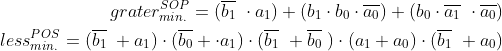

# Digital-electronics-1

https://github.com/SamuelBartko/Digital-electronics-1

# Second LAB O2-logic

## 1. 2-bit comparator truth table

| **Dec. equivalent** | **B[1:0]** | **A[1:0]** | **B is greater than A** | **B equals A** | **B is less than A** |
| :-: | :-: | :-: | :-: | :-: | :-: |
| 0 | 0 0 | 0 0 | 0 | 1 | 0 |
| 1 | 0 0 | 0 1 | 0 | 0 | 1 |
| 2 | 0 0 | 1 0 | 0 | 0 | 1 |
| 3 | 0 0 | 1 1 | 0 | 0 | 1 |
| 4 | 0 1 | 0 0 | 1 | 0 | 0 |
| 5 | 0 1 | 0 1 | 0 | 1 | 0 |
| 6 | 0 1 | 1 0 | 0 | 0 | 1 |
| 7 | 0 1 | 1 1 | 0 | 0 | 1 |
| 8 | 1 0 | 0 0 | 1 | 0 | 0 |
| 9 | 1 0 | 0 1 | 1 | 0 | 0 |
| 10 | 1 0 | 1 0 | 0 | 1 | 0 |
| 11 | 1 0 | 1 1 | 0 | 0 | 1 |
| 12 | 1 1 | 0 0 | 1 | 0 | 0 |
| 13 | 1 1 | 0 1 | 1 | 0 | 0 |
| 14 | 1 1 | 1 0 | 1 | 0 | 0 |
| 15 | 1 1 | 1 1 | 0 | 1 | 0 |



## 2. 2-bit comparator 

###The K-map for the "equals" function is as follows:


###The K-map for the "grater" function is as follows:


###The K-map for the "less" function is as follows:


<a href="https://www.codecogs.com/eqnedit.php?latex=\begin{align*}&space;f(b<a)&space;=&~&space;(b_{1}&space;&plus;&space;b_{0}&space;&plus;&space;a_{1}&space;&plus;&space;a_{0})&space;\cdot&space;(b_{1}&space;&plus;&space;\overline{b_{0}}\&space;&plus;&space;a_{1}&space;&plus;&space;a_{0})&space;\cdot&space;(b_{1}&space;&plus;&space;\overline{b_{0}}\&space;&plus;&space;a_{1}&space;&plus;&space;\overline{a_{0}}\)&space;\cdot&space;(\overline{b_{1}}\&space;&plus;&space;b_{0}&space;&plus;&space;a_{1}&space;&plus;&space;a_{0})&space;\cdot&space;(\overline{b_{1}}\&space;&plus;&space;b_{0}&space;&plus;&space;a_{1}&space;&plus;&space;\overline{a_{0}}\)&space;\cdot&space;(\overline{b_{1}}\&space;&plus;&space;b_{0}&space;&plus;&space;\overline{a_{1}}\&space;&plus;&space;a_{0})\\&space;\cdot&space;(\overline{b_{1}}\&space;&plus;&space;\overline{b_{0}}\&space;&plus;&space;a_{1}&space;&plus;&space;a_{0})&space;\cdot&space;(\overline{b_{1}}\&space;&plus;&space;\overline{b_{0}}\&space;&plus;&space;a_{1}&space;&plus;&space;\overline{a_{0}}\)&space;\cdot&space;(\overline{b_{1}}\&space;&plus;&space;\overline{b_{0}}\&space;&plus;&space;\overline{a_{1}}\&space;&plus;&space;a_{0})&space;\cdot&space;(\overline{b_{1}}\&space;&plus;&space;\overline{b_{0}}\&space;&plus;&space;\overline{a_{1}}\&space;&plus;&space;\overline{a_{0}}\)&space;\end{align*}" target="_blank"></a>

https://www.edaplayground.com/x/baHh

## 3. 4-bit comparator 


<a href="https://www.codecogs.com/eqnedit.php?latex=\begin{align*}&space;grater_{min.}^{SOP}&space;=&space;(\overline{b_{1}}\&space;\cdot&space;a_{1})&space;&plus;(&space;b_{1}&space;\cdot&space;b_{0}&space;\cdot&space;\overline{a_{0}}\)&space;&plus;&space;(b_{0}&space;\cdot&space;\overline{a_{1}}\&space;\cdot&space;\overline{a_{0}}\)\\&space;less_{min.}^{POS}&space;=&space;(\overline{b_{1}}\&space;&plus;&space;a_{1})&space;\cdot&space;(\overline{b_{0}}&space;&plus;&space;\cdot&space;a_{1})&space;\cdot&space;(\overline{b_{1}}\&space;&plus;&space;\overline{b_{0}}\&space;)&space;\cdot&space;(a_{1}&space;&plus;&space;a_{0})&space;\cdot&space;(\overline{b_{1}}\&space;&plus;&space;a_{0})&space;\\&space;\end{align*}" target="_blank"></a>

### Code
```vhdl

architecture dataflow of gates is
begin
    f1_o  <= ((x_i and y_i) or (x_i and z_i));
    f2_o  <= (x_i and (y_i or z_i));
    f3_o  <= ((x_i or y_i) and (x_i or z_i));
	f4_o  <= (x_i or (y_i and z_i));
end architecture dataflow;

```
### Graphs


https://www.edaplayground.com/x/b3B2