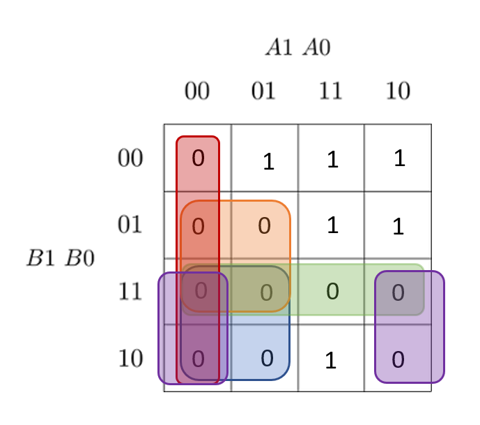

# Digital-electronics-1

https://github.com/SamuelBartko/Digital-electronics-1

# Second LAB O2-logic

## 1. 2-bit comparator truth table

| **Dec. equivalent** | **B[1:0]** | **A[1:0]** | **B is greater than A** | **B equals A** | **B is less than A** |
| :-: | :-: | :-: | :-: | :-: | :-: |
| 0 | 0 0 | 0 0 | 0 | 1 | 0 |
| 1 | 0 0 | 0 1 | 0 | 0 | 1 |
| 2 | 0 0 | 1 0 | 0 | 0 | 1 |
| 3 | 0 0 | 1 1 | 0 | 0 | 1 |
| 4 | 0 1 | 0 0 | 1 | 0 | 0 |
| 5 | 0 1 | 0 1 | 0 | 1 | 0 |
| 6 | 0 1 | 1 0 | 0 | 0 | 1 |
| 7 | 0 1 | 1 1 | 0 | 0 | 1 |
| 8 | 1 0 | 0 0 | 1 | 0 | 0 |
| 9 | 1 0 | 0 1 | 1 | 0 | 0 |
| 10 | 1 0 | 1 0 | 0 | 1 | 0 |
| 11 | 1 0 | 1 1 | 0 | 0 | 1 |
| 12 | 1 1 | 0 0 | 1 | 0 | 0 |
| 13 | 1 1 | 0 1 | 1 | 0 | 0 |
| 14 | 1 1 | 1 0 | 1 | 0 | 0 |
| 15 | 1 1 | 1 1 | 0 | 1 | 0 |

<a href="https://www.codecogs.com/eqnedit.php?latex=\begin{align*}&space;grater_{min.}^{SOP}&space;=&space;(\overline{b_{1}}\&space;\cdot&space;a_{1})&space;&plus;(&space;b_{1}&space;\cdot&space;b_{0}&space;\cdot&space;\overline{a_{0}}\)&space;&plus;&space;(b_{0}&space;\cdot&space;\overline{a_{1}}\&space;\cdot&space;\overline{a_{0}}\)\\&space;less_{min.}^{POS}&space;=&space;(\overline{b_{1}}\&space;&plus;&space;a_{1})&space;\cdot&space;(\overline{b_{0}}&space;&plus;&space;\cdot&space;a_{1})&space;\cdot&space;(\overline{b_{1}}\&space;&plus;&space;\overline{b_{0}}\&space;)&space;\cdot&space;(a_{1}&space;&plus;&space;a_{0})&space;\cdot&space;(\overline{b_{1}}\&space;&plus;&space;a_{0})&space;\\&space;\end{align*}" target="_blank"></a>


<a href="https://www.codecogs.com/eqnedit.php?latex=\begin{align*}&space;f(b<a)&space;=&~&space;(b_{1}&space;&plus;&space;b_{0}&space;&plus;&space;a_{1}&space;&plus;&space;a_{0})&space;\cdot&space;(b_{1}&space;&plus;&space;\overline{b_{0}}\&space;&plus;&space;a_{1}&space;&plus;&space;a_{0})&space;\cdot&space;(b_{1}&space;&plus;&space;\overline{b_{0}}\&space;&plus;&space;a_{1}&space;&plus;&space;\overline{a_{0}}\)&space;\cdot&space;(\overline{b_{1}}\&space;&plus;&space;b_{0}&space;&plus;&space;a_{1}&space;&plus;&space;a_{0})&space;\cdot&space;(\overline{b_{1}}\&space;&plus;&space;b_{0}&space;&plus;&space;a_{1}&space;&plus;&space;\overline{a_{0}}\)&space;\cdot&space;(\overline{b_{1}}\&space;&plus;&space;b_{0}&space;&plus;&space;\overline{a_{1}}\&space;&plus;&space;a_{0})\\&space;\cdot&space;(\overline{b_{1}}\&space;&plus;&space;\overline{b_{0}}\&space;&plus;&space;a_{1}&space;&plus;&space;a_{0})&space;\cdot&space;(\overline{b_{1}}\&space;&plus;&space;\overline{b_{0}}\&space;&plus;&space;a_{1}&space;&plus;&space;\overline{a_{0}}\)&space;\cdot&space;(\overline{b_{1}}\&space;&plus;&space;\overline{b_{0}}\&space;&plus;&space;\overline{a_{1}}\&space;&plus;&space;a_{0})&space;\cdot&space;(\overline{b_{1}}\&space;&plus;&space;\overline{b_{0}}\&space;&plus;&space;\overline{a_{1}}\&space;&plus;&space;\overline{a_{0}}\)&space;\end{align*}" target="_blank"></a>

https://www.edaplayground.com/x/baHh

## 2. 2-bit comparator 

### The K-map for the "equals" function is as follows:


### The K-map for the "grater" function is as follows:


### The K-map for the "less" function is as follows:




## 3. 4-bit comparator 

### Code of design.vhdl
```vhdl
library ieee;
use ieee.std_logic_1164.all;

------------------------------------------------------------------------
-- Entity declaration for 4-bit binary comparator
------------------------------------------------------------------------
entity comparator_2bit is
    port(
        a_i           : in  std_logic_vector(4 - 1 downto 0);
		b_i           : in  std_logic_vector(4 - 1 downto 0);

        -- COMPLETE ENTITY DECLARATION
		B_greater_A_o : out std_logic;    -- B is grater than A
		B_equals_A_o  : out std_logic;    -- B is equal to A
        B_less_A_o    : out std_logic     -- B is less than A
        
    );
end entity comparator_2bit;

------------------------------------------------------------------------
-- Architecture body for 2-bit binary comparator
------------------------------------------------------------------------
architecture Behavioral of comparator_2bit is
begin
    B_greater_A_o   <= '1' when (b_i > a_i) else '0';
	B_equals_A_o    <= '1' when (b_i = a_i) else '0';
    B_less_A_o      <= '1' when (b_i < a_i) else '0';

    -- WRITE "GREATER" AND "EQUALS" ASSIGNMENTS HERE


end architecture Behavioral;


```

### Code of testbench.vhdl
```vhdl
library ieee;
use ieee.std_logic_1164.all;

------------------------------------------------------------------------
-- Entity declaration for testbench
------------------------------------------------------------------------
entity tb_comparator_2bit is
    -- Entity of testbench is always empty
end entity tb_comparator_2bit;

------------------------------------------------------------------------
-- Architecture body for testbench
------------------------------------------------------------------------
architecture testbench of tb_comparator_2bit is

    -- Local signals
    signal s_a       : std_logic_vector(4 - 1 downto 0);
    signal s_b       : std_logic_vector(4 - 1 downto 0);
    signal s_B_greater_A : std_logic;
    signal s_B_equals_A  : std_logic;
    signal s_B_less_A    : std_logic;

begin
    -- Connecting testbench signals with comparator_2bit entity (Unit Under Test)
    uut_comparator_2bit : entity work.comparator_2bit
        port map(
            a_i           => s_a,
            b_i           => s_b,
            B_greater_A_o => s_B_greater_A,
            B_equals_A_o  => s_B_equals_A,
            B_less_A_o    => s_B_less_A
        );

    --------------------------------------------------------------------
    -- Data generation process
    --------------------------------------------------------------------
    p_stimulus : process
    begin
        -- Report a note at the begining of stimulus process
        report "Stimulus process started" severity note;


        -- 1. test values
        s_b <= "0000"; s_a <= "0000"; wait for 100 ns;
        -- Expected output
        assert ((s_B_greater_A = '0') and (s_B_equals_A = '1') and (s_B_less_A = '0'))
        -- If false, then report an error
        report "Test failed for input combination: 0000, 0000" severity error;
        
         -- 2. test values
        s_b <= "0000"; s_a <= "0001"; wait for 100 ns;
        -- Expected output
        assert ((s_B_greater_A = '0') and (s_B_equals_A = '0') and (s_B_less_A = '1'))
        -- If false, then report an error
        report "Test failed for input combination: 00, 01" severity error;
        
         -- 3. test values
        s_b <= "0000"; s_a <= "0010"; wait for 100 ns;
        -- Expected output
        assert ((s_B_greater_A = '0') and (s_B_equals_A = '0') and (s_B_less_A = '1'))
        -- If false, then report an error
        report "Test failed for input combination: 0000, 0010" severity error;
        
         -- 5. test values
        s_b <= "0000"; s_a <= "0101"; wait for 100 ns;
        -- Expected output
        assert ((s_B_greater_A = '0') and (s_B_equals_A = '1') and (s_B_less_A = '0'))
        -- If false, then report an error
        report "Test failed for input combination: 0000, 0101" severity error;
        
         -- 16. test values
        s_b <= "0001"; s_a <= "0000"; wait for 100 ns;
        -- Expected output
        assert ((s_B_greater_A = '1') and (s_B_equals_A = '0') and (s_B_less_A = '0'))
        -- If false, then report an error
        report "Test failed for input combination: 0001, 0000" severity error;
        
         -- 17. test values
        s_b <= "0001"; s_a <= "0001"; wait for 100 ns;
        -- Expected output
        assert ((s_B_greater_A = '0') and (s_B_equals_A = '1') and (s_B_less_A = '0'))
        -- If false, then report an error
        report "Test failed for input combination: 0001, 0001" severity error;
        
         -- 18. test values
        s_b <= "0001"; s_a <= "0010"; wait for 100 ns;
        -- Expected output
        assert ((s_B_greater_A = '0') and (s_B_equals_A = '1') and (s_B_less_A = '0'))
        -- If false, then report an error
        report "Test failed for input combination: 0001, 0001" severity error;
        
         -- 21. test values
        s_b <= "0001"; s_a <= "0101"; wait for 100 ns;
        -- Expected output
        assert ((s_B_greater_A = '0') and (s_B_equals_A = '0') and (s_B_less_A = '1'))
        -- If false, then report an error
        report "Test failed for input combination: 0001, 0101" severity error;
        
		-- 24. test values
        s_b <= "0001"; s_a <= "1000"; wait for 100 ns;
        -- Expected output
        assert ((s_B_greater_A = '0') and (s_B_equals_A = '0') and (s_B_less_A = '1'))
        -- If false, then report an error
        report "Test failed for input combination: 0001, 1000" severity error;
        
        -- 30. test values
        s_b <= "0010"; s_a <= "1110"; wait for 100 ns;
        -- Expected output
        assert ((s_B_greater_A = '1') and (s_B_equals_A = '0') and (s_B_less_A = '0'))
        -- If false, then report an error
        report "Test failed for input combination: 0001, 0101" severity error;
        
        
        
        
        -- WRITE OTHER TESTS HERE


        -- Report a note at the end of stimulus process
        report "Stimulus process finished" severity note;
        wait;
    end process p_stimulus;

end architecture testbench;
end entity comparator_2bit;

------------------------------------------------------------------------
-- Architecture body for 2-bit binary comparator
------------------------------------------------------------------------
architecture Behavioral of comparator_2bit is
begin
    B_greater_A_o   <= '1' when (b_i > a_i) else '0';
	B_equals_A_o    <= '1' when (b_i = a_i) else '0';
    B_less_A_o      <= '1' when (b_i < a_i) else '0';

    -- WRITE "GREATER" AND "EQUALS" ASSIGNMENTS HERE


end architecture Behavioral;


```


https://www.edaplayground.com/x/iQ2b