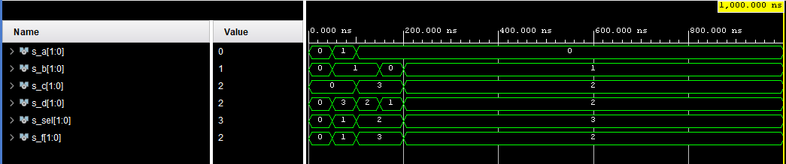

# Digital-electronics-1

https://github.com/SamuelBartko/Digital-electronics-1

# Third LAB O2-vivado

## 1. Table with connection of 16 slide switches and 16 LEDs on Nexys A7 board

### SWITCH

| **Component** | **Pin** |
| :-: | :-: |
| SW0 | J15 | 
| SW1 | L16 |
| SW2 | M13 |
| SW3 | R15 |
| SW4 | R17 |
| SW5 | T18 |
| SW6 | U18 |
| SW7 | R13 | 
| SW8 | T8 | 
| SW9 | U8 |
| SW10 | R16 | 
| SW11 | T13 | 
| SW12 | H6 |
| SW13 | U12 | 
| SW14 | U11 | 
| SW15 | V10 | 

### LED

| **Component** | **Pin** |
| :-: | :-: |
| LED0 | H17 |
| LED1 | K15 |
| LED2 | J13 |
| LED3 | N14 |
| LED4 | R18 |
| LED5 | V17 |
| LED6 | U17 |
| LED7 | U16 |
| LED8 | V16 |
| LED9 | T15 |
| LED10 | U14 |
| LED11 | T16 |
| LED12 | V15 |
| LED13 | V14 |
| LED14 | V12 |
| LED15 | V11 |


## 2. Two-bit wide 4-to-1 multiplexer

### Code of design.vhdl

```vhdl
architecture Behavioral of mux_2bit_4to1 is
begin
  f_o   <= a_i when (sel_i = "00") else
           b_i when (sel_i = "01") else
           c_i when (sel_i = "10") else
           d_i;
	
    -- WRITE "GREATER" AND "EQUALS" ASSIGNMENTS HERE


end architecture Behavioral;

```

### Code of testbench.vhdl
```vhdl

 p_stimulus : process
    begin
        -- Report a note at the begining of stimulus process
        report "Stimulus process started" severity note;
        
        s_d <= "00"; s_c <= "00"; s_b <= "00"; s_a <= "00";
        s_sel <= "00"; wait for 50 ns;
        
        s_a <= "01"; s_b <= "01"; s_d <= "11"; s_c <= "00";
        s_sel <= "01"; wait for 50 ns;
        
        s_d <= "10"; s_c <= "11"; s_b <= "01"; s_a <= "00"; 
        s_sel <= "10"; wait for 50 ns;
        
        s_d <= "01"; s_c <= "11"; s_b <= "00"; s_a <= "00"; 
        s_sel <= "10"; wait for 50 ns;
        
        s_d <= "10"; s_c <= "10"; s_b <= "01"; s_a <= "00";
        s_sel <= "11"; wait for 50 ns;

       
        report "Stimulus process finished" severity note;
        wait;
    end process p_stimulus;

```



## 3. Vivado tutorial

Coming soon...