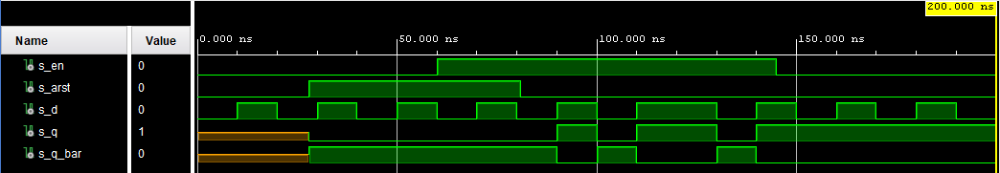
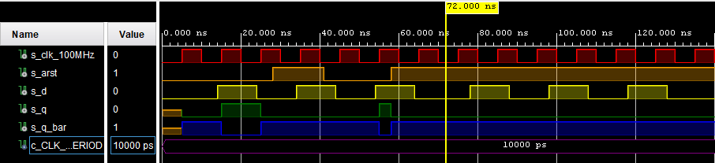
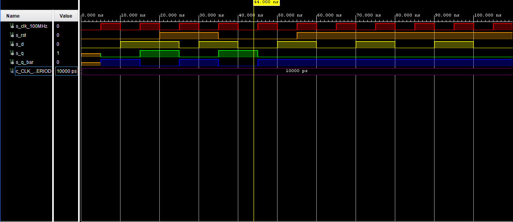
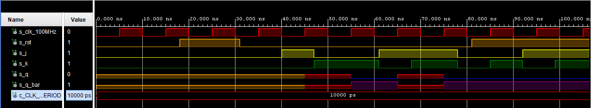
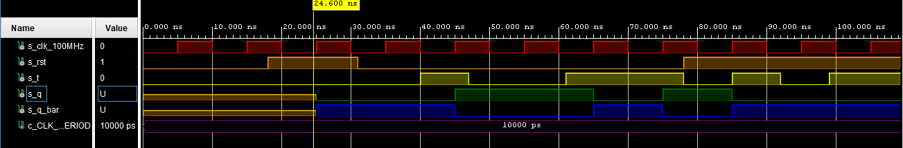

# Digital-electronics-1

https://github.com/SamuelBartko/Digital-electronics-1

# Seventh LAB 06-ffs

## 1. Characteristic equations and tables for D, JK, T flip-flops.

### Equasion for D 
<a href="https://www.codecogs.com/eqnedit.php?latex=\begin{align*}&space;q_{n&plus;1}&space;=&space;&~&space;d&space;&\&space;\end{align*}" target="_blank"></a>

  | **D** | **Qn** | **Q(n+1)** | **Comments** |
   | :-: | :-: | :-: | :-- |
   | 0 | 0 | 0 | No change |
   | 0 | 1 | 0 | Invert (Toggle) |
   | 1 | 0 | 1 | Invert (Toggle) |
   | 1 | 1 | 1 | No change |

### Equasion for JK
<a href="https://www.codecogs.com/eqnedit.php?latex=\begin{align*}&space;q_{n&plus;1}&space;=&~&space;j\overline{q}{n}\&space;&plus;\overline{k}q_{n}&space;&\&space;\end{align*}" target="_blank"></a>

   | **J** | **K** | **Qn** | **Q(n+1)** | **Comments** |
   | :-: | :-: | :-: | :-: | :-- |
   | 0 | 0 | 0 | 0 | No change |
   | 0 | 0 | 1 | 1 | No change |
   | 0 | 1 | 0 | 0 | Reset |
   | 0 | 1 | 1 | 0 | Reset |
   | 1 | 0 | 0 | 1 | Set |
   | 1 | 0 | 1 | 1 | Set |
   | 1 | 1 | 0 | 1 | Toggle |
   | 1 | 1 | 1 | 0 | Toggle |

### Equasion for T
<a href="https://www.codecogs.com/eqnedit.php?latex=\begin{align*}&space;q_{n&plus;1}&space;=&space;&~&space;t\overline{q}_{n}\&space;&plus;\overline{t}q_{n}&space;\end{align*}" target="_blank"></a>

   | **T** | **Qn** | **Q(n+1)** | **Comments** |
   | :-: | :-: | :-: | :-- |
   | 0 | 0 | 0 | No change |
   | 0 | 1 | 1 | No change |
   | 1 | 0 | 1 | Invert (Toggle) |
   | 1 | 1 | 0 | Invert (Toggle) |

## 2. D latch

### Code of the process `p_d_latch`

```vhdl

    p_d_latch : process (d, arst, en)
    begin

        if (arst = '1') then
            q     <= '0';
            q_bar <= '1';
        elsif (en = '1') then
            q <= d;
            q_bar <= not d;
        end if;
    
     end process p_d_latch;

```

### Code of the process `tb_d_latch`

```vhdl


```



## 3. Flip-flops

### Code of the process `p_d_ff_arst`

```vhdl


```

### Code of the process `p_d_ff_rst`

```vhdl

p_d_ff_rst : process (clk)
    
    begin
    
        if rising_edge(clk) then
            if (rst = '1') then
                q <= '0';
                q_bar <= '1';
            else
                q <= d;
                q_bar <= not d;
            end if;
        end if;
        
    end process p_d_ff_rst;

```

### Code of the process `p_jk_ff_rst`

```vhdl


```

### Code of the process `p_t_ff_rst`

```vhdl


```
------------------------------------------------------------------------------------------
### Code of the `tb_d_ff_arst`

```vhdl


```

### Code of the `tb_d_ff_rst`

```vhdl

--------------------------------------------------------------------
    -- Reset generation process
    --------------------------------------------------------------------

     p_reset_gen : process
        begin
            s_rst <= '0';
            wait for 20 ns;
            
            -- Reset activated
            s_rst <= '1';
            wait for 15 ns;
    
            --Reset deactivated
            s_rst <= '0';
            wait for 20 ns;
            
            s_rst <= '1';
            wait for 350 ns;
  
            wait;
     end process p_reset_gen;

    --------------------------------------------------------------------
    -- Data generation process
    --------------------------------------------------------------------
    
    p_stimulus : process
    begin
        report "Stimulus process started" severity note;
        
        s_d  <= '0';
        
        --d sekv
        wait for 10 ns;
        s_d  <= '1';
        wait for 5 ns;
        
        assert ((s_rst = '0') and (s_q = '1') and (s_q_bar = '0'))
        report "Test failed for reset low, after clk rising when s_d = '1'" severity error;
        
        wait for 10 ns;
        s_d  <= '0';
        wait for 5 ns;
        s_d  <= '1';
        wait for 10 ns;
        s_d  <= '0';
        wait for 10 ns;
        s_d  <= '1';
        wait for 5 ns;
        
        -- verify that reset is truly synchronous
        assert ((s_rst = '1') and (s_q = '1') and (s_q_bar = '0'))
        report "Test failed for reset high, before clk rising when s_d = '1'" severity error;
        
        wait for 5 ns;
        s_d  <= '0';
        --/d sekv
        
        --d sekv
        wait for 10 ns;
        s_d  <= '1';
        wait for 10 ns;
        s_d  <= '0';
        wait for 10 ns;
        s_d  <= '1';
        wait for 10 ns;
        s_d  <= '0';
        wait for 10 ns;
        s_d  <= '1';
        wait for 10 ns;
        s_d  <= '0';
        --/d sekv
             
        report "Stimulus process finished" severity note;
        wait;
    end process p_stimulus;

```

### Code of the `tb_jk_ff_rst`

```vhdl


```

### Code of the `tb_t_ff_rst`

```vhdl


```

### Screenshot with simulated time waveforms for `tb_d_ff_arst`
 


### Screenshot with simulated time waveforms for `tb_d_ff_rst`
 



### Screenshot with simulated time waveforms for `tb_jk_ff_rst`
 


### Screenshot with simulated time waveforms for `tb_t_ff_rst`
 


## 4. Shift register

### Code of the process `top`

```vhdl


```

